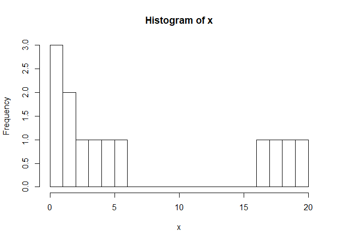

<!-- README.md is generated from README.Rmd. Please edit that file -->
cutr
====

cutr extends `base::cut.default`'s possibilities, getting inspiration from existing alternatives such as `Hmisc::cut2` and the `ggplot2::cut_*` family of functions, but going much further.

Installation
------------

You can install cutr from github with:

``` r
# install.packages("devtools")
devtools::install_github("moodymudskipper/cutr")
```

default behavior + `closed` and `open_end`
------------------------------------------

We build a distribution and show the default behavior, in the rest of the document we'll show results using `table` as it's more telling.

``` r
library(cutr)
x <- c(rep(1,3),rep(2,2),3:6,17:20)
hist(x,breaks = 0:20)
```



``` r
cuts <- c(0,5,10,20)
smart_cut(x,cuts)
#>  [1] [0,5)   [0,5)   [0,5)   [0,5)   [0,5)   [0,5)   [0,5)   [5,10) 
#>  [9] [5,10)  [10,20] [10,20] [10,20] [10,20]
#> Levels: [0,5) < [5,10) < [10,20]
table(smart_cut(x,cuts))
#> 
#>   [0,5)  [5,10) [10,20] 
#>       7       2       4
```

The output is very similar to what we get with `base` or `Hmisc` and `ggplot2` alternatives.

``` r
table(base::cut(x,cuts))
#> 
#>   (0,5]  (5,10] (10,20] 
#>       8       1       4
table(Hmisc::cut2(x,cuts))
#> 
#> [ 0, 5) [ 5,10) [10,20] 
#>       7       2       4
table(smart_cut(x,cuts,"breaks"))
#> 
#>   [0,5)  [5,10) [10,20] 
#>       7       2       4
```

A the difference with `base` is that we close by default the left size, this can be changed by setting the `closed` parameter to `"right"`.

Another is that the ends are both closed in `smart_cut`, this can be changed by setting the `open_end` parameter to `FALSE`

`closed` is borrowed from `ggplot2::cut_*` functions, and corresponds to the `RIGHT` parameter of `base::cut.default`.

`open_end` corresponds to the (negated) `include.lowest` parameter of `base::cut`.

The difference with `Hmisc` is due to the formatting function, which is `formatC` for `cut` and `smart_cut`, and `format` for `Hmisc` (which gives all labels the same width). The display of `smart_cut` is highly flexible thanks to the argument `format_fun` detailed further in this document.

`what` and `i`
--------------

The `what` parameter determines how cuts will be chosen, depending on the value of `i`.

``` r
table(smart_cut(x,cuts,"breaks"))                   # fixed breaks
#> 
#>   [0,5)  [5,10) [10,20] 
#>       7       2       4
table(smart_cut(x,2,"groups"))                      # groups defined by quantiles
#> 
#>  [1,3) [3,20] 
#>      5      8
table(smart_cut(x,list(2,"balanced"),"groups"))     # optimized groups of equal size
#> 
#>  [1,4) [4,20] 
#>      6      7
table(smart_cut(x,3,"n_by_group"))                  # try to get 3 items by group using quantiles
#> 
#>   [1,3)  [3,17) [17,20] 
#>       5       4       4
table(smart_cut(x,list(3,"balanced"),"n_by_group")) # try to get 3 items by group using optimization
#> 
#>       1   [2,4)  [4,17) [17,20] 
#>       3       3       3       4
table(smart_cut(x,3,"n_intervals"))                 # intervals of equal width
#> 
#>     [1,7.333) [7.333,13.67)    [13.67,20] 
#>             9             0             4
table(smart_cut(x,7,"width"))                       # interval of equal defined width, start on 1st value
#> 
#>   [1,8)  [8,15) [15,22] 
#>       9       0       4
table(smart_cut(x,list(7,"right"),"width"))         # interval of equal defined width, end on last value
#> 
#>  [-1,6)       6 [13,20] 
#>       8       1       4
table(smart_cut(x,list(6,"centered"),"width"))      # interval of equal defined width, centered
#> 
#>  [-1.5,4.5)  [4.5,10.5) [10.5,16.5) [16.5,22.5] 
#>           7           2           0           4
table(smart_cut(x,list(6,"centered0"),"width"))     # interval of equal defined width, centered on 0
#> 
#>  [-3,3)   [3,9)  [9,15) [15,21] 
#>       5       4       0       4
table(smart_cut(x,list(7,0),"width"))               # interval of equal defined width, starting on 0
#> 
#>   [0,7)  [7,14) [14,21] 
#>       9       0       4
table(smart_cut(x,3,"cluster"))                     # create groups by running a kmeans clustering
#> 
#>     [1,3.5)  [3.5,11.5) [11.5,19.5] 
#>           6           3           3
```

`simplify`
----------

`TRUE` by default, when a value is the only one in its group, display it as a label, without brackets. Similar to `oneval` in `Hmisc::cut2`.

``` r
table(smart_cut(x, 5, "width", simplify = TRUE))
#> 
#>   [1,6)       6 [11,16) [16,21] 
#>       8       1       0       4
table(smart_cut(x, 5, "groups", simplify = FALSE))
#> 
#>   [1,2)   [2,5)  [5,17) [17,20] 
#>       3       4       2       4
```

`expand`
--------

expand makes sure all values from x will be in an interval by expanding the cut points. `base::cut.default` never expands, `Hmisc::cut2` always expands.

``` r
table(smart_cut(x,c(4,10,18)))
#> 
#>   [1,4)  [4,10)      17 [18,20] 
#>       6       3       1       3
table(smart_cut(x,c(4,10,18),expand = FALSE))
#> 
#>  [4,10) [10,18] 
#>       3       2
```

`crop`
------

`crop` is `FALSE` by default, if `TRUE` the side intervals are reduced to fit the data.

``` r
table(smart_cut(x,c(0,10,30)))
#> 
#>  [0,10) [10,30] 
#>       9       4
table(smart_cut(x,c(0,10,30),crop = TRUE))
#> 
#>  [1,10) [10,20] 
#>       9       4
```

`squeeze`
---------

`squeeze` is `FALSE` by default, if `TRUE` every interval is reduced to fit the data.

``` r
table(smart_cut(x,c(0,10,30)))
#> 
#>  [0,10) [10,30] 
#>       9       4
table(smart_cut(x,c(0,10,30),squeeze = TRUE))
#> 
#>   [1,6] [17,20] 
#>       9       4
```

`brackets` + `sep`
------------------

Different brackets can be chosen

``` r
table(smart_cut(x,c(0,10,30), brackets = c("]","[","[","]")))
#> 
#>  [0,10[ [10,30] 
#>       9       4
table(smart_cut(x,c(0,10,30), brackets = NULL, sep = "~", squeeze= TRUE))
#> 
#>   1~6 17~20 
#>     9     4
```

`labels`
--------

`labels` can be a vector just like in `base::cut.default`, but it can also be a function of 2 arguments, which are a vector of values contained in the interval and a vector of cutpoints.

``` r
table(smart_cut(x,c(4,10)))
#> 
#>   [1,4)  [4,10) [10,20] 
#>       6       3       4
table(smart_cut(x,c(4,10),labels = ~mean(.x)))   # mean of values by interval
#> 
#> 1.667     5  18.5 
#>     6     3     4
table(smart_cut(x,c(4,10),labels = ~mean(.y)))   # center of interval
#> 
#> 2.5   7  15 
#>   6   3   4
table(smart_cut(x,c(4,10),labels = ~median(.x))) # median
#> 
#>  1.5    5 18.5 
#>    6    3    4
table(smart_cut(x,c(4,10),labels = ~paste(
  sep="~",.y[1],round(mean(.x),2),.y[2]))) # a more sophisticated label
#> 
#>   1~1.67~4     4~5~10 10~18.5~20 
#>          6          3          4
```

`format_fun`
------------

With `cutr` the user can provide any formating function through the argument `format_fun`, including the package function `format_metric` (more info on value formating in the dedicated section).

``` r
table(smart_cut(x^6 + x/100,5,"g"))
#> 
#>                  1.01     [64.02,1.563e+04) [1.563e+04,2.414e+07) 
#>                     3                     4                     2 
#>   [2.414e+07,6.4e+07] 
#>                     4
table(smart_cut(x^6 + x/100,5,"g",format_fun = format, digits = 3))
#> 
#>                1.01 [6.40e+01,1.56e+04) [1.56e+04,2.41e+07) 
#>                   3                   4                   2 
#> [2.41e+07,6.40e+07] 
#>                   4
table(smart_cut(x^6,5,"g",format_fun = signif))
#> 
#>                  1         [64,15625)   [15625,24137600) 
#>                  3                  4                  2 
#> [24137600,6.4e+07] 
#>                  4
table(smart_cut(x^6,5,"g",format_fun = smart_signif))
#> 
#>                  1         [64,15600)   [15600,24100000) 
#>                  3                  4                  2 
#> [24100000,6.4e+07] 
#>                  4
table(smart_cut(x^6,5,"g",format_fun = format_metric))
#> 
#>               1     [64,15.6 k) [15.6 k,24.1 M)   [24.1 M,64 M] 
#>               3               4               2               4
```

more on `groups`
----------------

`groups` and `n_by_group` try to place cut points at relevant quantile positions, we won't get the required number of groups if several quantiles fall on the same value, to remedy to this we can use an optimization function (the default one will most likely be enough).

``` r
table(smart_cut(x,3,"groups"))
#> 
#>      1  [2,6) [6,20] 
#>      3      5      5
table(smart_cut(x,list(3,"balanced"),"groups"))
#> 
#>   [1,3)  [3,17) [17,20] 
#>       5       4       4
```

the second element of the list can be a string (which will be mapped to a predefined function) or a cusom made 2 argument function that is applied on all possible bin combinations : Bin size is the first argument and the cut points is the second. the combination that return the lowest value when passed to optim\_fun will be selected (or the first of them if the minimum is not unique). "balanced" minimizes the variance between groups and will work for most purposes.

`cutf` and `cutf2`
------------------

These are copies of `base::cut.default` and `Hmisc::cut2` with the difference that the formatting function can be used freely. All the features are contained in `smart_cut` but these functions allow users to keep the interface, and defaults of the function they know and to modify existing code easily, for example to leverage `format_metric` with minimal effort.
